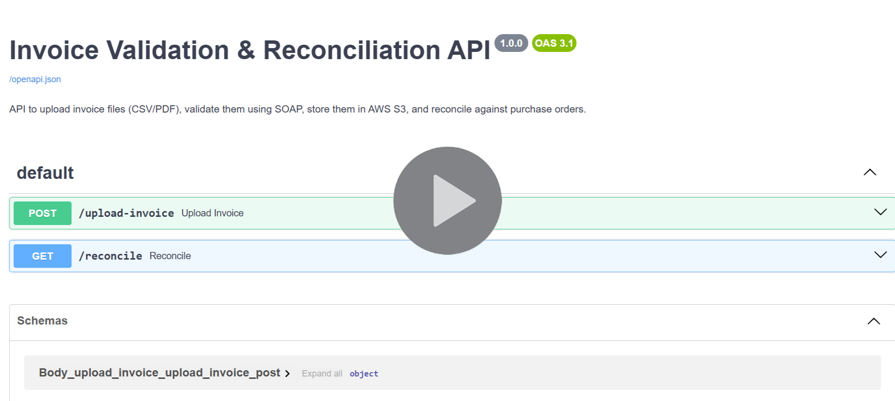

# 🧾 Invoice Validation & Reconciliation Mini System

A mini full-stack application to upload, validate, and reconcile invoice data against purchase orders using FastAPI, MySQL, AWS S3 (simulated/real), and PHP frontend.

## 📽️ Project Demo

<a href="https://drive.google.com/file/d/1uFRPBoTRfqjXYCgSavwE-iux6mhinB-R/view?usp=sharing" target="_blank">
  
</a>

## 🚀 Features

- Upload invoice files (CSV/PDF)
- Automatic metadata extraction from uploaded files
- Validate invoice amount via SOAP (NumberToWords API)
- Save files locally and to AWS S3
- Store metadata with their validation status in MySQL database
- Reconcile invoices vs purchase orders (by vendor + amount)
- Expose reconciliation results via REST API
- Basic PHP frontend that consumes reconciliation API


## 🧰 Tech Stack

- **Backend**: FastAPI, SQLAlchemy, Python
- **Database**: MySQL
- **Storage**: AWS S3 (via `boto3`) 
- **SOAP API**: Zeep (`NumberToWords`)
- **PDF Parsing**: PyMuPDF (fitz)
- **Frontend**: PHP + cURL (optional)
- **Extras**: `.env` configuration, file upload, CORS, logging


## 📦 Project Structure

```text
invoice-system/
├── app/
│ ├── main.py                         # FastAPI app and routes
│ ├── models.py                       # SQLAlchemy models
│ ├── schemas.py                      # Pydantic schemas
│ ├── database.py                     # DB connection
│ ├── s3_utils.py                     # S3 upload logic
│ └── load_dummy_pos.py               # Script to load sample purchase orders
├── soap/
│ └── soap_utils.py                   # Zeep SOAP client (NumberToWords)
├── dummy_data/
│ ├── dummy_po.csv                    # Sample POs
│ └── dummy_invoice_matched.csv       # Sample matched invoice file (csv)
│ └── dummy_invoice_unmatched.csv     # Sample unmatched invoice file (csv)
│ └── dummy_invoice_matched.pdf       # Sample matched invoice file (pdf)
├── invoice-frontend/
│ └── reconcile.php                   # Simple frontend
├── uploads/                          # Local file uploads (auto-created)
├── .env                              # Environment variables
├── requirements.txt                  # Python dependencies
└── README.md
```


## ⚙️ Setup & Run Instructions

### 1. 📦 Clone the Repository

```bash
git clone https://github.com/HasyaHansanganie/Invoice-Validation-Reconciliation-System.git
cd invoice-system
```

### 2. 🐍 Create Virtual Environment

```bash
python -m venv venv
venv\Scripts\activate  # On Windows
# OR
source venv/bin/activate  # On macOS/Linux
```

### 3. 📥 Install Python dependencies

```bash
pip install -r requirements.txt
```

### 4. 🗃️ Database Setup (MySQL)
Start your MySQL server (locally or with a tool like XAMPP)

Create the database manually:

```bash
CREATE DATABASE invoice_system;
```

### 5. 🔐 Set Up Environment Variables

Update your .env with MySQL and AWS credentials.

```bash
MYSQL_USER=your_mysql_user
MYSQL_PASSWORD=your_mysql_password
MYSQL_DB=invoice_system
MYSQL_HOST=localhost

AWS_ACCESS_KEY_ID=your_aws_key
AWS_SECRET_ACCESS_KEY=your_aws_secret
AWS_BUCKET_NAME=your_bucket
AWS_REGION=us-east-1
```

### 6. 🧪 Load Sample Purchase Orders

```bash
python -m app.load_dummy_pos
```

This loads sample POs from dummy_data/dummy_po.csv.

### 7. 🚀 Run the Backend Server

```bash
uvicorn app.main:app --reload
```

Open Swagger Docs at:
```bash
http://localhost:8000/docs
```

### 8. 📤 Test Upload Endpoint

Use /upload-invoice in Swagger UI.

Upload invoice files and execute. (CSV or PDF)

✅ Will extracts metadata, validates via SOAP, upload to local folder + S3, stores in DB

### 9. 🔍 Reconciliation Endpoint

Use /reconcile in Swagger to return match status for each invoice.

Example response:

```bash
{
  "reconciliation": [
    {
      "invoice_number": "INV001",
      "vendor": "ABC Ltd",
      "amount": 1000,
      "status": "Matched",
      "po_number": "PO001"
    }
  ]
}
```

### 10. 🌐 Run the PHP Frontend

Prerequisites:
PHP installed and added to PATH

Run frontend:
```bash
cd invoice-frontend
php -S localhost:8080
```

Then open in browser:
```bash
http://localhost:8080/reconcile.php
```

### 📝 Notes
Make sure your FastAPI app is running for frontend to work
